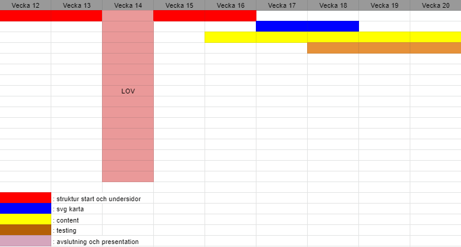
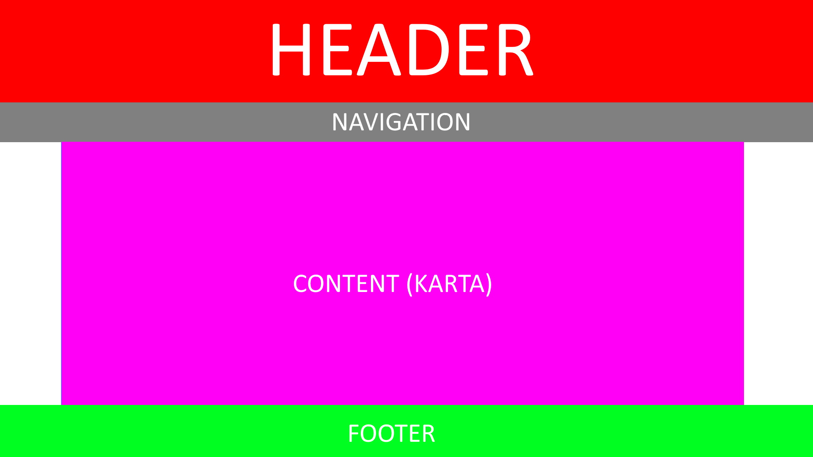

# projektet

## Sammanfattning

Denna sida är skriven som en informationskälla om den europeeiska unionen EU och är riktad till låg till mellanstadieelever. Hemsidan tar upp kort info om varje land som är medlem samt kort information om unionens historia, vad den är, och hur unionen samarbetar med Sverige. På startsidan finns även en interaktiv kart där de som vågar sig på kan genom sina geografiska kunskaper kliak på det land som de vill veta information om.

## Planering

Från början så var det mycket stökigt i mitt huvud med idéer överallt på hur saker skulle se ut m.m. Jag gjorde snabbt upp ett arbetsschema för att få en visuell bild på hur arbetet skulle utföras och under hur långt tidsspann det skulle vara. 
    
Planen kändes väldigt bestämd och jag var redo att följa den. Det var inte min fösta gång med att göra en hemsida då jag i princip gjort en tidigare också, dock så var det mycket svårare denna gång då jag skulle anpassa den in i det minsta samt ha med saker som jag inte hade någon större kunskap om eller visste hur man skulle anpassa. Jag hade även väldigt mycket annat för mig med skolan vilket gjorde så att detta projekt inte fick lika mycket tid åt sig som det krävde vilket påverkade resultatet. Dessa faktorer ledde till att schemat blev reviserat till en mer tidsomfattande version som såg ut så här: 
    
Under Lovet så jobbade jag även med diverse saker vilket drog ner tiden lite grann. Avslutningen och dokumetationen skedde även efter planderingen och det är därför den inte står med. Detta gav mig tid att arbeta med hemsidan in i det sista för att få till så mycket jag kunde, och till så hög kvalité som möjligt.
## Den interaktiva kartan

De interaktiva kartan är skapat från ett svg-element. Ett svg-element, eller Scaleable Vector Graphic, är ett XML-baserat Vektorgrafikfilformat som används för interaktiva tvådimensionella bilder.

Jag fick idén från mitt huvud men jag blev inspirerad från geografihemsidan [Seterra.com](https://online.seterra.com/sv) då de har liknande kartor i spelform där man får klicka på kartan och länderna. Jag visste dock inte att det var SVG som man använde för det och efter lite random research så hittade jag en artikel som gick igenom exakt hur man skulle göra för att få en fungerande och responsiv karta där man kan klicka på länderna. 
[Här är hemsidan](https://websitebeaver.com/how-to-make-an-interactive-and-responsive-svg-map-of-us-states-capitals#making-it-responsive)

Utifrån det så improviserade jag baserat på mina egna kunskaper och ändrade på både HTML-koden och CSS-koden för att få önskat resultat. Till exemplel så gjorde jag så att endast de länderna som är medlem i EU kan klickas på och lite småsaker.

SVG-kartan var även gratis nedladdad, Royalty free, från [Simplemaps.com](https://simplemaps.com/resources/svg-europe).

## Hemsidans uppbyggnad

Hemsidan är uppbyggd på en gridarkitektur som var planderad från början och skulle se ut så här, roughly:
    
Och gjordes på detta sättet:

```CSS
    body {
        ...

        display: grid;
        grid-template-columns: repeat(12, 1fr);
        grid-template-rows: 150px auto 1fr auto;
        grid-template-areas: 
        "H H H H H H H H H H H H"
        "N N N N N N N N N N N N"
        ". C C C C C C C C C C ."
        "F F F F F F F F F F F F"
        ;

        ...
    }
```
