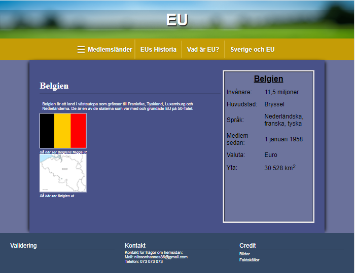

# projektet

## Sammanfattning

Denna sida är skriven som en informationskälla om den europeeiska unionen EU och är riktad till låg till mellanstadieelever. Hemsidan tar upp kort info om varje land som är medlem samt kort information om unionens historia, vad den är, och hur unionen samarbetar med Sverige. På startsidan finns även en interaktiv kart där de som vågar sig på kan genom sina geografiska kunskaper klicka på det land som de vill veta information om.

## Planering

Projektet började arbetas på 2021-03-22 och blev klart 2021-05-23, alltså ca 2 månaders arbete från brainstorm till färdig produkt. Detta upplevdes i början som en väldigt lång tid och att jga skulle ha på mig massvis med tid, men i slutändan blev det väldigt tajt ändå.

Från början så var det mycket stökigt i mitt huvud med idéer överallt på hur saker skulle se ut m.m. Jag gjorde snabbt upp ett arbetsschema för att få en visuell bild på hur arbetet skulle utföras och under hur långt tidsspann det skulle vara. 
    


Planen kändes väldigt bestämd och jag var redo att följa den. Det var inte min fösta gång med att göra en hemsida då jag i princip gjort en tidigare också, dock så var det mycket svårare denna gång då jag skulle anpassa den in i det minsta samt ha med saker som jag inte hade någon större kunskap om eller visste hur man skulle anpassa. Jag hade även väldigt mycket annat för mig med skolan vilket gjorde så att detta projekt inte fick lika mycket tid åt sig som det krävde vilket påverkade resultatet. Dessa faktorer ledde till att schemat blev reviserat till en mer tidsomfattande version som såg ut så här: 
    

    
Under Lovet så jobbade jag även med diverse saker vilket drog ner tiden lite grann. Avslutningen och dokumetationen skedde även efter planderingen och det är därför den inte står med. Detta gav mig tid att arbeta med hemsidan in i det sista för att få till så mycket jag kunde, och till så hög kvalité som möjligt.

Denna revidering var nödvändig både för mig men framförallt om jag hade arbetat med en medarbetare. Detta eftersom om det är flera som arbetar så är det väldigt bra om mer personer än jag vet hur arbetet ska gå. Det blir då både lättare och mer effektivt då alla vet vad de ska göra genom att bara kolla på schemat.

## Hemsidans uppbyggnad

Hemsidan är uppbyggd på en gridarkitektur som var planderad från början och skulle se ut så här, roughly:
    
Och gjordes på detta sättet:

```CSS
    body {
        ...

        display: grid;
        grid-template-columns: repeat(12, 1fr);
        grid-template-rows: 150px auto 1fr auto;
        grid-template-areas: 
        "H H H H H H H H H H H H"
        "N N N N N N N N N N N N"
        ". C C C C C C C C C C ."
        "F F F F F F F F F F F F"
        ;

        ...
    }
```
Där H är header, N är navbar, C är content, och F är footer

Sidorna med content hade jag en idé på hur de skulle se ut, men jag ändrade mig under arbetet. Jag gjorde däremot ingen ändrad skiss på den nya designen då jag hade den i huvudet. Detta fungerade bra nu, men som jag nämnde tidigare, om jag hade jobbat med andra så hande det varit bra att göra en så att alla är på samma sida när det kommer till idéer.

Så här såg idén ut från början:
    

Och så här ser den ut på slutprodukten:
        

Nu i efterhand så tycket jag att båda sätten är bra alternativ. Den första idén hade lite mer struktur än hur edt faktiskt blev då man lätt kan anvädna sig av grid, men det andra alternativet 

## Den interaktiva kartan

De interaktiva kartan är skapat från ett svg-element. Ett svg-element, eller Scaleable Vector Graphic, är ett XML-baserat Vektorgrafikfilformat som används för interaktiva tvådimensionella bilder.

Jag fick idén från mitt huvud och kunde direkt dra paraleller till geografihemsidan [Seterra.com](https://online.seterra.com/sv) då de har liknande kartor i spelform där man får klicka på kartan och länderna, och blev inspirerad. Jag visste dock inte att det var SVG som man använde för det och efter lite random research så hittade jag en artikel som gick igenom exakt hur man skulle göra för att få en fungerande och responsiv karta där man kan klicka på länderna. 
[Här är hemsidan](https://websitebeaver.com/how-to-make-an-interactive-and-responsive-svg-map-of-us-states-capitals#making-it-responsive)

Den som skrivit artikeln gav läsarna tillåtelse att använda koden som han lärde ut, så det var det jag gjorde, vilket underlättade extremt mycket.

Utifrån det så improviserade jag baserat på mina egna kunskaper och ändrade på både HTML-koden och CSS-koden för att få önskat resultat. Till exemplel så gjorde jag så att endast de länderna som är medlem i EU kan klickas på och lite småsaker.

SVG-kartan var även gratis nedladdad, Royalty free, från [Simplemaps.com](https://simplemaps.com/resources/svg-europe).

## Validering och hastighet

Alla html- och css-filer är validerade på [validator.w3.org](https://validator.w3.org/) respektive [jigsaw.w3c.org](https://jigsaw.w3.org/css-validator/). Hemsidan hade från början många problem som jag som tur va upptäckte i tid för att ändra på innan jag stötte på allt för många problem. Exempel på dessa problem var till exempel fel child till element och så. Majoriteten av problemen hade med SVG att göra så det var bara att ta bort det de klagade på så fixades det utan att det påverkade hemsidan.

Jag har använt mig av två olika 16:9 1080p skärmar, en laptop och en desktop, en 21:9 1442p skärm, och min och en annans mobil för at testa hemsidan för att få till optimering för alla enheter. Tillsammans med det så har jag använt mig av chromes inbyggda storleksfunktion där man kan kolla hur hemsidan ser ut i varje bredd och varje höjd, vilket hjälpte mycket när jag skulle andvända mig av mdeia-queries.

Jag anvädne mig även av Chrome-tillägget [lighthouse](https://developers.google.com/web/tools/lighthouse). Vad detta gör är att kolla på olika områden såsom prestanda, tillgänglighet för alla användare m.m, och ger ett betyg av 100. Det var många saker som jag ansåg som småsaker som de tyckte skulle ändras på. Till exempel så var tillgängligheten lite sämre då kontrasten var för liten på vissa delar av hemsidan mellan text och bakgrund. Vad detta leder till är att färgblinda personer eller personer med nedsatt syn har det svårare att använda sidan. För att lösa detta så gick jag bara in i CSS och ökade kontrasten så att det blev bättre och mer läsbart.

Lighouse tyckte även att bilderna kunde komprimeras för att göra hemsidan snabbare, så det var edt jag gjorde. Jag gjorde detta genom att lägga in bilderna som användes i [iloveimg.com](https://www.iloveimg.com/sv/komprimera-bild).

Hemsidan testades även på olika webbläsare såsom, Firefox, Edge, internet explorer, samt google chrome. Alla dessa testades i olika upplösningar med tillfredsställande resultat. Testerna gjordes i [Browserstack](https://www.browserstack.com/). 

Det är värt att nämna att internet explorer inte har enn uppdaterad standard och därav fungerar varken css grid eller kartan, som är skriven i XML, och därför kan internet explorer försummas.

## Riktlinjer

Hemsidan är testad av både mig och andra personer och har fått konstruktiv kridik om hur tydlig, snygg, och informativ den är. Strartsidan är till för att informera om sidan och ur den fungerar, navbaren hänvisar till subsidor med tydlighet. Projektet anses ha bra tillänglighet utifrån tester och är utvecklad utifrån standard.

Alla sidor använder utf-8 som teckenkodning vilket är enligt standard för HTML-5, och innebär att tecken såsom "ÅÄÖ" blir "ÅÄÖ" och inte ���. Detta är viktigt att ange så folk från andra länder som inte har utf-8 som teckenkonding som standard på sit operativsystem fortfarande kan se korrekta tecken.

Alla sidor har även svenska som språk, dvs
```HTML
    <html lang="sv">
```
Detta berättar för webbläsaren vilket internationellt språk hemsidan är skrivet på och gör det lättare för den att rekommendera den till rätt folk.

## Tredjepartskod
Jag har vid två tillfällen under projektets gång använt mig utav kod som inte jag själv skrivit. Ett utav de är akrtan och dess funktion, som jag nämnde tidigare, den andra är sidebaren som åker ut när man klickar på knappen "Medlemsländer". Sidebaren skapade jag med hjälp av en YouTube tutorial från kanalen [CodingFlag](https://www.youtube.com/channel/UCXDLrsqe14uFu6k96xjlF4w). Jag Tog endast javascriptet och dess idn för att få funktionen, resten gjorde jag för egen hand. Länken till videon: https://www.youtube.com/watch?v=uWUNZ4u1VLA&ab_channel=Codingflag

Det är viktigt att verkligen kolla igenom och ha lite vetskap om koden när man lånar kod från någon annan hemsida eller tutorial (efter att ha frågat om lov förståss). Detta därför att det finns risk för farlig kod gömd inuti kod som ser okej ut från utsidan. Kod som till exempel kan sno känslig och/eller personlig information vilket är en laglig och identitetsrisk.
Just i detta fallet så var koden så simpel att farlig kod kudne upptäckas på ett lätt sätt, men om längre kod skulle användas så blir risket att farlig kod smiter förbi.

## Bilder och upphovsrätt
Alla bilder använda på hemsidan var antingen nedladdade från [Pixabay.com](https://pixabay.com/sv/) eller gjorda av mig, som i fallet med flaggorna, dvs Jag, Hannes Nilsson, gjorde flaggorna själv för att undvika onödiga copyrightproblem. Informationen som används på sidan är endast tagen från [Europa.eu](https://europa.eu/european-union/index_sv) vilket är EUs officiella hemsida och har information i den allmänna domänen.

Detta innebär att i mitt fall så gäller inte några copyright-lagar då de gratis nedladdade bilderna är royalty free vilket innebär att jag kan använda upphovsrättsskyddat material utan att behöva betala för rättigheterna att använda bilderna. Vilka är lagarna och var innebär dem?

Upphovsrätt, eller copyright som det heter på engelska, är den ekonomiska och ägande rätten till ett originellt verk som den som skapat verket har. Denna person kallas för upphovsperson och får bestämma hur, var, och om verket får användas. Oftast så kräver. Upphovsrätt till ett verk försvinner 70 år efter hupphovspersonen dött och verket övergår till det publika domänet.

Någonting som även kan vara aktuellt är frågor om etik när det gäller bilder eller namngivningar på andra personer eller privata ägodelar så som bilar. Just Om jag till exempel hade haft bilder på personer på min hemsida så hade jag antingen behövt be om lov att få använda en bild på dem på min hemsida, eller så hade jag behövt sudda ut personens ansikte. Just i mitt fall så är jag den enda perosnen som nämns och jag samtycker med mig själv att mitt namn får användas.

Enligt kapitel 1, paragraf 1 om upphovsrätt så omfattas upphovsrätt av:

    1 §   Den som har skapat ett litterärt eller konstnärligt verk har upphovsrätt till verket oavsett om det är
    1. skönlitterär eller beskrivande framställning i skrift eller tal,
    2. datorprogram,
    3. musikaliskt eller sceniskt verk,
    4. filmverk,
    5. fotografiskt verk eller något annat alster av bildkonst,
    6. alster av byggnadskonst eller brukskonst, eller
    7. verk som har kommit till uttryck på något annat sätt.

    Till litterära verk hänförs kartor, samt även andra i teckning eller grafik eller i plastisk form utförda verk av beskrivande art.

    Vad som i denna lag sägs om datorprogram skall i tillämpliga delar gälla även förberedande designmaterial för datorprogram.
    Lag (1994:190).

Upphovsrätt gäller däremot inte för yttranden av svenska myndigheter, eller beslut av svenska myndigheter, och det är därför jag får använda mig utav denna lagtext utan att be om lov. [Riksdagen.se](https://www.riksdagen.se/sv/dokument-lagar/dokument/svensk-forfattningssamling/lag-1960729-om-upphovsratt-till-litterara-och_sfs-1960-729)

Straffet för att bryta mot upphovslagen kan vara böter eller fängelse, och beroende på graden så kan fängelsestraffet vara i upp till sex år. [Lagen.nu](https://lagen.nu/sou/2018:6)

Olika lagar gäller för olika länder däremot så det gäller att vara försiktig när jobbar med hemsidor som jag gör i detta fallet då andra regler kan gälla. Det är väldigt suddiga gränser på vad som är ok och inte nuförtiden så det gäller att ha stenkoll så man inte råkar ut för ett brott.

Jag själv anser upphovsrättslagar som väldigt nödvändiga då det finns väldigt många personer som livnär sig på att skapa originella verk, vilket innebär att om någon skulle ta ens verk och tjäna pengar på det så hade personen som skapade verket gått miste om pengar, särskiljt om de jobbat hårt påå verket. En sak som är värd att diskutera är ver man ska dra gränsen, och vad som är etsikt. Till exempel så är upphovsrätt på en låt helt annorlunda mot upphovsrätt på ett läkemedel. Om läkemedlet är livsviktigt så kan det vara skillnad på liv och död att hålla på receptet endast för att tjäna pengar.

## Webbhotell

## Allmänna förbättringar

## Slutsats